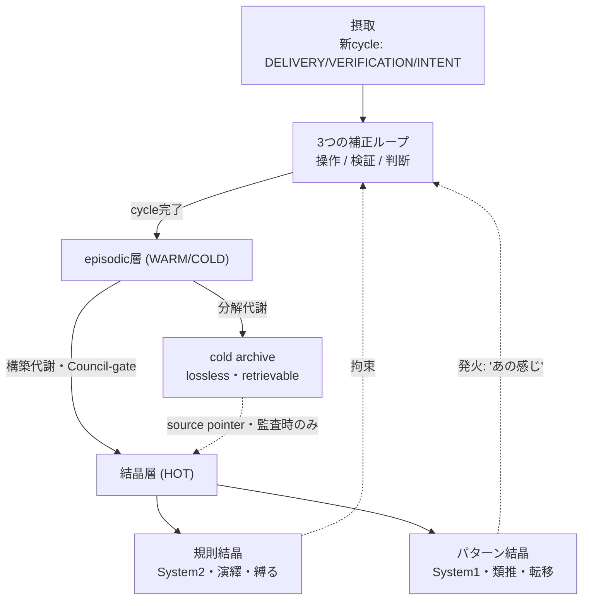

# THEORY（仮結晶 / 暫定公理）— context 情報の生きる循環 cycle

> **状態: 仮結晶（暫定公理・試用期間中）。** philosophy.md（6 条憲法）の**完全並列ではない**。
> 本理論は「結晶化＝判断の先取り。拙速な固化は禁物」と説く。その戒めを**自分自身に自己適用**し、
> いきなり philosophy 並びの本結晶（co-equal な正典）にはせず、**仮結晶**として置く。
> 昇格は二段階——System1 的に「この理論が効く」と現場で繰り返し発火し、System2 審査（Council ＋ 人間 P4）が
> 本結晶化を要求したときにのみ philosophy 並びへ昇格する（§11 昇格プロセス）。
> Council 批准: `history/COUNCIL-LOG.md` `council-2026-05-31T01:00:00Z-thry01`（「修正してから結晶化」）。
>
> on-demand reference（購読量に常時は乗らない・progressive disclosure）。実装拘束は `metabolism-regime.md` / `reindex-protocol.md`。

---

## 0. この文書の位置づけ

| 項目 | 値 |
|---|---|
| 層 | 理論 / 哲学（実装の前段）・**仮結晶** |
| 関係 | philosophy.md の系（companion・昇格待ち）。metabolism-regime.md / reindex-protocol.md はこの理論の実装拘束部分 |
| 範囲 | 文脈情報がどう入り・巡り・結晶し・発火し・排出されるか の全体 |
| 状態 | 理論＝合意（P4/D5 著述）/ 結晶化形態＝仮結晶（Council thry01 裁定）/ §10 に確定・未決を分離 |
| 日付 | 2026-05-31 |

---

## 1. 中心命題 — 文脈は保管物ではなく循環する代謝

**文脈情報は「貯める対象」ではなく「巡らせる対象」である。**

蓄積モデル（context＝ストレージ）は必然的に重くなる。実測根拠: history+delivery は約 925 行/cycle で単調増加し、context loading が支配する「代謝天井」で開発が停止する。DH 定義では **情報代謝の停止＝組織の唯一の死**。

循環モデル（context＝代謝）はこれを回避する。情報は入り、ループを巡り、結晶化し、新状況で発火し、抜け殻は排出され、結晶が次の cycle を加速する。**生きている限り軽い。** これが「生きる循環」。

「プロジェクト特化 context を保持したまま速く」への答えは、循環の中の **結晶化（判断の先取り）** から来る。**圧縮ではない**（§5）。

---

## 2. 循環の全体像（5 相）

**摂取 → 循環（3 ループ）→ 結晶化（構築代謝）→ 発火（結晶が次 cycle に作用）→ 排出（分解代謝）。**



結晶が破線でループへ戻るのが核——**結晶知性が未来の処理を加速する閉ループ**。

---

## 3. 循環を駆動する 3 つのループ

文脈は「期待⇔現実の擦り合わせ」を**3 つの粒度**で巡る（P1 フラクタル＝同一形状の異粒度反復）。

| 層 | 対象 | グレーダー | バジェット | エスカレーション | 認知 |
|---|---|---|---|---|---|
| 操作層 | コンパイル/型/lint/test/CLI | code（決定論的） | 高（事実上ループ） | 人間に上げない | System 1 寄り |
| 検証層 | 仕様適合/動作/UX/意図合致 | model＋独立レビュアー | 有界（〜3） | FAIL 継続で献上 | — |
| 判断層 | 設計/不可逆/価値衝突 | human（D5） | human-in-loop | 即献上 | System 2 |

**位相の選択はレイヤー依存。** 操作層は無限反復＋code-graded が正しい（Evaluator-optimizer / Claude Code 内ループ）。判断層は**有界＋献上**（DH 循環ループ）。「無限反復ループ」をガバナンスに使うのは誤りで、操作層に置くのは正しい。

**「100 の細かいエラーを潰せば 1 つの大きなエラーを避けられる」の真偽:** カスケード型には真（操作層が上層ノイズを吸収＝P3 保護）。だが**設計/意図エラーには偽かつ危険**——症状を潰すほど誤設計が entrench する。ゆえに操作層は独立ループではなく上方への**昇格インターフェース**を持つ（機械的エラーの再発→設計問題として判断層へ）。

---

## 4. 結晶化 — episodic から叡智へ（構築代謝＋分解代謝）

| 代謝 | 役割 | 操作 | トリガー |
|---|---|---|---|
| 構築代謝 | 生ログから密な叡智を作る | 反復パターン → 罠/RL/DOMAINS/invariants に蒸留 | パターンが閾値回反復 |
| 分解代謝 | 抜け殻を作業集合から外す | 蒸留済み episodic を cold archive へ | 結晶化完了後 |

**結晶化だけでは速くならない（むしろ重い）。** 速度は anabolic＋catabolic のペアから生まれる。
3 層保持（HOT/WARM/COLD）・昇降格・担い手（reindex-librarian = L0/D4）・リズム（token 閾値・睡眠相）の正本は `metabolism-regime.md`。

---

## 5. 圧縮 ≠ 結晶化（「圧縮率が低い」への決着）

**圧縮は復元志向、結晶化は判断志向。直交する。** 超圧縮を結晶化と混同してはいけない。

| | 操作1: 可逆圧縮 | 操作2: 意味的非可逆圧縮 | 操作3: 結晶化 |
|---|---|---|---|
| 例 | gzip/zstd, 算術符号 | LLMLingua-2, RAPTOR 要約 | reindex-librarian |
| 目標 | 同じバイトを少ビットで | task 関連の意味を少トークンで | 新しい正典 artifact を著述 |
| 成功指標 | 完全復元 | 意味原子 Recall | **判断の先取り（再導出回避）** |
| 復元する？ | する（バイト） | する（意味） | **しない（元は捨てる）** |
| DH tier | COLD | WARM | **HOT** |
| 担い手 | アルゴリズム | アルゴリズム | **L0 判断＋Council** |

**核心: 操作3 はアルゴリズムではなく判断行為。** どんな圧縮も結晶化を生まない（圧縮は「入力の復元」を測り、結晶化は「将来判断の回避」を測るから）。

**速度の出所（through-line）:**
- 圧縮（操作1・2）: トークン費↓、だが**判断導出費はそのまま**（解凍後フル詳細から再導出）。
- 結晶化（操作3）: **判断導出費↓**（決定そのものを保存。再導出しない）。
- ∴ **速度はほぼ全て操作3 から来る。圧縮は最も効かない部分。** ←「圧縮率が低い」への答えは「圧縮を測るのが誤り。本丸は結晶化」。

**実在技術の居場所（fact-checked）:** 採用＝RAPTOR（WARM 多解像度ツリー）/ gzip・zstd（COLD 監査）/ MemGPT（HOT/WARM/COLD の先行研究裏取り）。過剰/早期＝Nacrith（135M 解凍要・過剰）/ SemanticZip（著者自ら pilot 明記・意味原子 13–20% 喪失）/ KV Cache Pruning（HOT を小さく保つ設計では原則不要）。不採用＝LJPW（φ と意識を持ち出す疑似科学。正当な核＝意図を固定次元 RL に抽出は DH が既に DOMAINS/invariants/DONT で保持）。

---

## 6. 二種の結晶 — 規則結晶とパターン結晶

結晶には**高度（altitude）**がある。`metabolism-regime.md` までで設計したのは規則結晶。応用のきく計画には**パターン結晶**が要る。

| | 規則結晶 | パターン結晶 |
|---|---|---|
| 認知 | 演繹（rule-following） | 類推（analogy / recognition） |
| 形式 | 「X するな / 必ず Y」 | 「これは"あの感じ"→この定石」 |
| 発火 | 条件一致（binary） | 類似度（fuzzy・連想） |
| 転移（応用） | 低い（スコープ外で脆い） | **高い（未知に効く）** |
| 例 | 52 罠 / invariants / DON'T | 「partway 失敗しうる変更→冪等化」 |
| 失敗モード | スコープ漏れ | 偽類推（表層一致で誤発火） |
| 認知システム | System 2 | System 1 |

**人間の記憶が「はっきり覚えていないが直感として働く」のは、結晶知性が特定状況下で発火するから。** 認知科学の合流点（**外部理論への参照＝接地であり権威依存ではない。あくまで補強であって正当化根拠の置換ではない**）: 結晶性知能 Gc（Cattell-Horn-Carroll）/ チャンク仮説（Chase & Simon 1973）/ RPD（Klein, 認識駆動意思決定）/ 技能 5 段階（Dreyfus）/ パターン・ランゲージ（Alexander → GoF）/ 二重過程理論（Kahneman）。

DH はシステムを「**規則に従う初心者**（罠/RL）」から「**状況型を再認して定石を当てる熟達者**」へ引き上げる。**未知への計画＝発火したパターンの合成**（「これは[スケジューリング]＋[承認 WF]＋[通知]だ」）。

### LLM での実装（天井を明記・ハンドウェーブしない）

- ベース重みは既に一般的 Gc（汎用パターン）を持つ。我々が作るのは**プロジェクト固有の結晶層**＝このコードベースの肌触り。
- **fine-tune 不可（OAuth/Max サブスク）ゆえ、固有結晶は重みでなく HOT＋retrieval に置く。良い近似だが天井あり**（重みに焼けないため、発火は外部索引のマッチ精度に律速される）。
- **発火の機械的実装＝embedding 索引。** パターン結晶を**発火条件で索引**し、現状況を embed して top-k 発火。生ログにベクトル検索は筋が悪いが、**結晶（発火条件）にかけるのは正しい仕事**。
- **HOT 予算の天井 → tier 化:** コア少数を常駐 HOT、ロングテールは索引発火（境界は §10 未決）。

---

## 7. 発火と検証の相互チェック（ガバナンス）

System 1 の代償は**誤発火**。直観は「高妥当性環境」でのみ信頼でき、表層類似に騙される（Kahneman）。「これは CRUD フォームだ」と発火したら実は取引整合性を要する画面だった、は破滅的。

**設計原理: 二種の結晶が互いを処分する。**

```
パターン結晶（生成・速い・可謬） ──提案→ プラン候補
                                        │
規則結晶＋センサー（検証・遅い） ──処分→ 実行 or 却下
```

**System 1 が提案し、System 2 が処分する。** §3 の操作/検証ループとも献上の有界化とも同型（P1 フラクタル）。

---

## 8. 不変条件（8 つ・lossy 圧縮を毒にしない憲法）

§1–5 は `metabolism-regime.md §5` に正本（実装拘束）。本理論は #6–#8 を追加する。

1. 早すぎる結晶化の禁止（HOT 昇格は Council ゲート）
2. COLD ＝ archive ≠ delete（監査可能性を破壊しない・retrievable）
3. 叡智に source pointer（cold 原本への逆引き）
4. 代謝自体のコストを抑える（sparse＋冪等）
5. 独自補完しない（蒸留であって捏造でない）
6. **結晶化は COLD lossless 原本から読む（不変条件 A）。** WARM の lossy 層からは読まない——lossy-on-lossy 汚染（13–20% 欠けた意図から正典を作る）を防ぐ
7. **「情報欠損なし」は HOT の誤った目標（不変条件 B）。** lossless は COLD 監査層に隔離、HOT は forgetting is a feature で意図的に lossy。捨てるから速い
8. **パターン結晶は反-発火条件を必須化。** 形式に「いつ適用しないか」を含める。反例（falsification）が偽類推の唯一の防壁。誤パターンは fuzzy に誤発火し debug 困難ゆえ昇格証拠は規則結晶より高く。**【caveat】#8 はパターン結晶の形式が確定（§10 未決）してから発効する。形式未確定の現時点では「方針」であって運用必須条件ではない**

---

## 9. なぜ循環は速度を生むか（統合）

| 機構 | 効果 | 由来 |
|---|---|---|
| 判断の先取り | 規則結晶を読んで即実行、再導出しない | §4・§5 |
| 未知＝合成認識 | パターン結晶の発火で未知を既知の組合せとして計画 | §6 |
| 純度回復 | 抜け殻ノイズを排出し HOT の信号対雑音比↑ | §3・§4（P3） |
| context の在り処 | 再利用 context は結晶（罠/SPEC/INTENT/パターン）に住む。生ログは抜け殻 | §5 |

**回避すべき思い込み:「全部保持しないと context を失う」。** 生ログは context の在り処ではなく抜け殻の置き場。捨てる対象と context の在り処を取り違えると循環が止まる。

---

## 10. 未決事項（**未解決・次セッション・実装仕様ではない**）

> ⚠ 以下は**確定していない**。本理論を「実装仕様」と読んではならない（開発者ペルソナ指摘）。実装拘束は `metabolism-regime.md` / `reindex-protocol.md` の確定分のみ。

- パターン結晶の形式 `{発火条件, 反-発火条件, 力学, 定石, 信頼度}` を確定するか（Alexander/GoF 準拠・反例必須）
- コア常駐 HOT と ロングテール索引の境界（チャンク天井→索引発火の切替点）
- RAPTOR を WARM 層に実採用するか
- token 閾値の具体値（初回 reindex の実測から）
- 軸B 時間軸（clean-state 短 ⇄ 履歴結晶化 長）の共通排出機構への統合

---

## 11. 仮結晶 → 本結晶の昇格プロセス（自己適用）

本理論は自分の説（System1 提案・System2 処分／拙速結晶化の禁止）を**自分の定着に適用する**:

1. **仮結晶（現在）**: 本理論は試用される。各セッション/cycle で「この理論が現場で効いたか（発火したか）」を観測する
2. **発火の蓄積**: 理論が繰り返し有効に発火した事例が閾値回たまる（regime の `council_gate.repetition_threshold` に準ずる）
3. **System2 審査**: Council ＋ 人間 P4 が「philosophy 並びの本結晶へ昇格すべきか」を審査
4. **本結晶化 or 棄却/改訂**: 昇格なら philosophy.md の系として co-equal 化。未達なら仮結晶のまま、または §10 の解消を待つ

これにより「理論を今 canonize する行為自体が拙速固化の反例になる」自己言及的緊張（哲学者ペルソナ指摘）を構造で解く。

---

## 付録: 出典

- Anthropic「Building effective agents」(2024-12) /「Demystifying evals for AI agents」(2026-01)
- 認知科学: Cattell-Horn-Carroll (Gc) / Chase & Simon 1973 / Klein (RPD) / Dreyfus / Kahneman
- 設計: C. Alexander『A Pattern Language』/ GoF『Design Patterns』
- 圧縮: MemGPT(2023) / RAPTOR(ICLR2024) / LLMLingua-2 / SemanticZip(pilot) / Nacrith
- DH: `philosophy.md` / `metabolism-regime.md` / `reindex-protocol.md` / HANDOFF（情報代謝サイクル）
